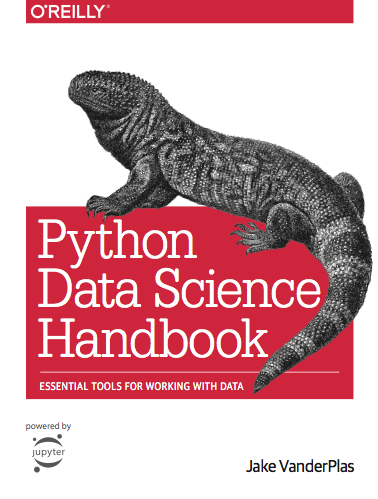

### Python Data Science Handbook (for Dummies like me)

Completely inspired by Jake's Python Data Science Handbook I decided to redo the examples in the Jupyter Notebooks from scratch in a way that even the most beginner of beginners could understand.

In hopes that someone with no python or data science experience can follow.

I will be supplementing these notebooks with videos on my [YT](https://www.youtube.com/channel/UCHTqK9UTcXw99HWKQjmAi7g?view_as=subscriber) channel as well 

### Python Data Science Handbook

This repository contains the entire [Python Data Science Handbook](http://shop.oreilly.com/product/0636920034919.do), in the form of (free!) Jupyter notebooks.

### How to Use this Book

- Read the book in its entirety online at https://jakevdp.github.io/PythonDataScienceHandbook/

- Run the code using the Jupyter notebooks available in this repository's [notebooks](notebooks) directory.

- Launch executable versions of these notebooks using [Google Colab](http://colab.research.google.com): 

- Launch a live notebook server with these notebooks using [binder](https://beta.mybinder.org/): 

- Buy the printed book through [O'Reilly Media](http://shop.oreilly.com/product/0636920034919.do)